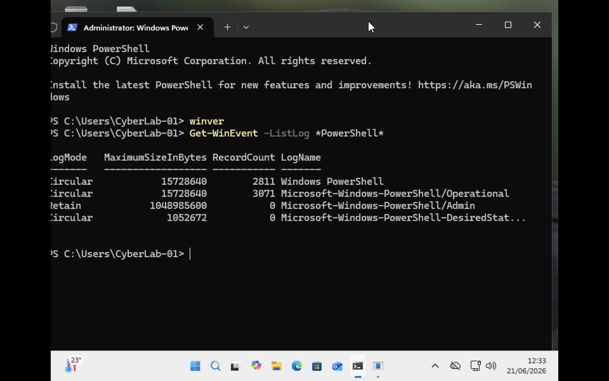
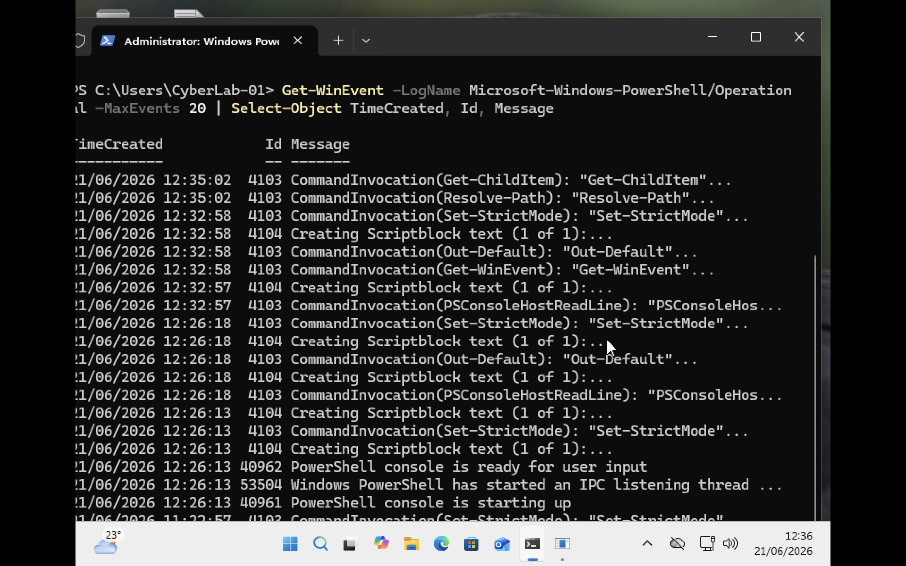
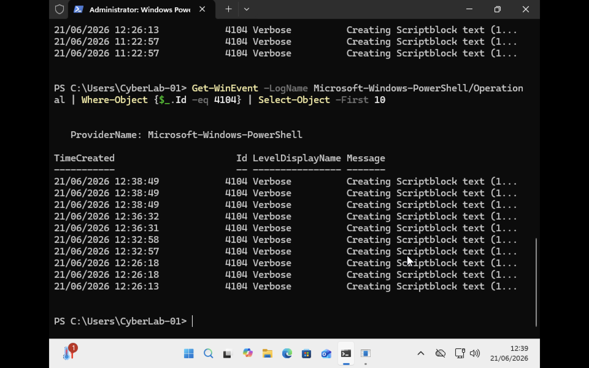

# PowerShell Logging Verification


The purpose of this phase was to verify that PowerShell logging was available within the Windows 11 ARM64 virtual machine and that PowerShell activity could be collected for behavioural analysis. The project environment uses Windows PowerShell Operational Logs as the primary data source for identifying behavioural indicators associated with PowerShell activity.


## Verification of PowerShell Logging Channels

The following command was used to identify available PowerShell logging channels:

```powershell
Get-WinEvent -ListLog *PowerShell*
```

The results confirmed that the **Microsoft-Windows-PowerShell/Operational** log was available and actively recording events.

### Evidence



The presence of the Operational log confirmed that PowerShell activity could be collected and analysed within the lab environment.


## Verification of PowerShell Event Collection

The following command was used to review recent PowerShell Operational events:

```powershell
Get-WinEvent -LogName Microsoft-Windows-PowerShell/Operational -MaxEvents 20 |
Select-Object TimeCreated, Id, Message
```

The results showed several PowerShell events including:

* Event ID 4103 (Module Logging)
* Event ID 4104 (Script Block Logging)

### Evidence




The presence of Event IDs 4103 and 4104 demonstrated that PowerShell command activity was being recorded and could be used for behavioural analysis.


## Verification of Script Block Logging

The following command was used to isolate Script Block Logging events:

```powershell
Get-WinEvent -LogName Microsoft-Windows-PowerShell/Operational |
Where-Object {$_.Id -eq 4104} |
Select-Object -First 10
```

### Evidence




Event ID 4104 entries were successfully identified within the PowerShell Operational log. Script Block Logging provides visibility into PowerShell command execution and is particularly valuable for detecting suspicious or unusual behaviour.

## Key Event IDs Identified

| Event ID | Description          | Relevance                                       |
| -------- | -------------------- | ----------------------------------------------- |
| 4103     | Module Logging       | Records PowerShell module activity              |
| 4104     | Script Block Logging | Records PowerShell command and script execution |


## Findings

The Windows 11 Home ARM64 virtual machine successfully generated PowerShell Operational Log events without requiring additional **Group Policy configuration.** Both Event ID 4103 and Event ID 4104 were available and actively recording PowerShell activity. These events provide a suitable data source for behavioural monitoring and further analysis of both benign and suspicious PowerShell activity.

The successful verification of PowerShell logging confirms that the lab environment is ready for behavioural analysis experiments.

