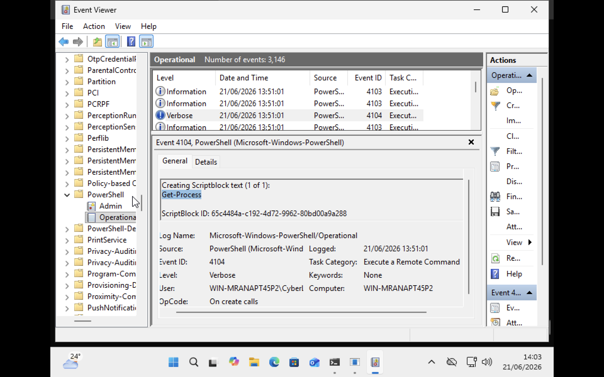
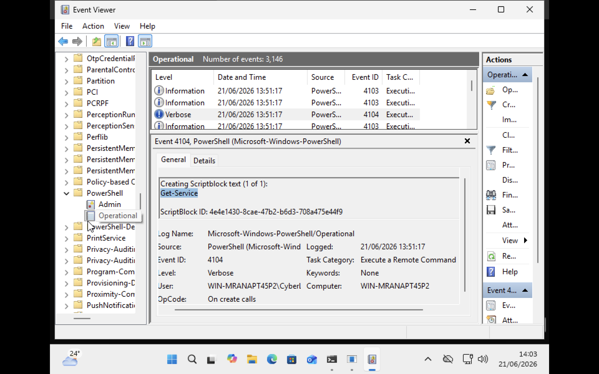
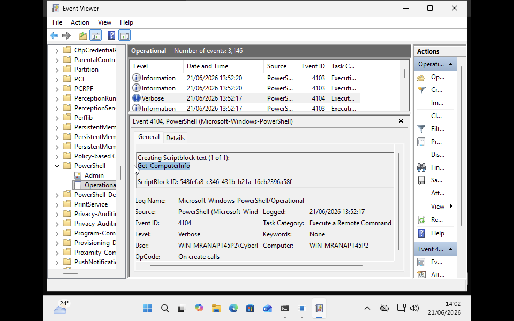

# Benign Activity Analysis


This phase establish a baseline of **normal PowerShell activity** and observe how common administrative commands appear within PowerShell Operational Logs. Understanding normal PowerShell behaviour is important because security analysts must distinguish legitimate administrative activity from malicious activity.


## Commands Executed

Multiple commands were executed using Windows PowerShell and analysed through the Microsoft-Windows-PowerShell/Operational log. The following commands were executed within the Windows virtual machine:

```powershell
Get-Process
Get-Service
Get-ChildItem
Get-ComputerInfo
Get-Location
```

## Get-Process
The following screenshot is the evidnce that the all commands are logged into operational log.


Event ID 4104 recorded the execution of the `Get-Process` command.

### Behaviour Analysis

This command is commonly used by system administrators to view currently running processes. Although considered normal administrative activity, similar commands may also be used by attackers during the discovery phase of an intrusion.

### Classification

Benign Administrative Activity


## Get-Service


Event ID 4104 recorded the execution of the `Get-Service` command.

### Behaviour Analysis

The command was used to retrieve information about services running on the system. It is common administrative task and it is frequently observed during routine system management.

### Classification

Benign Administrative Activity

## Get-ComputerInfo



Event ID 4104 recorded execution of the `Get-ComputerInfo` command.

### Behaviour Analysis

The command provides detailed operating system and hardware information. While It is commonly used for administration and troubleshooting, similar information gathering behaviour may also appear during attacker **reconnaissance.**

### Classification

Benign Administrative Activity
## More Commands
I run thesse commands as well in powershell to dipicts normal powershell activity.
### `Get-Location`
The command displays the current working directory within PowerShell. This behaviour is considered routine shell navigation activity. It is also Benign Administrative Activity.

### `Get-ChildItem`
This command is used to view files and folders within a directory. It represents normal filesystem navigation activity. It is also Benign Administrative Activity

## Summary of Observed Activity

| Command          | Event ID | Behaviour Category           |
| ---------------- | -------- | ---------------------------- |
| Get-Process      | 4104     | Process Inspection           |
| Get-Service      | 4104     | Service Enumeration          |
| Get-ChildItem    | 4104     | File System Navigation       |
| Get-ComputerInfo | 4104     | System Information Retrieval |
| Get-Location     | 4104     | Shell Navigation             |


## Findings

All tested commands generated Event ID 4104 within the PowerShell Operational Log. The logs successfully recorded the **exact PowerShell commands executed through Script Block Logging.** This demonstrates that PowerShell Operational Logs can provide visibility into administrative activity and establish a behavioural baseline for comparison against suspicious activity in later stages of the project.

