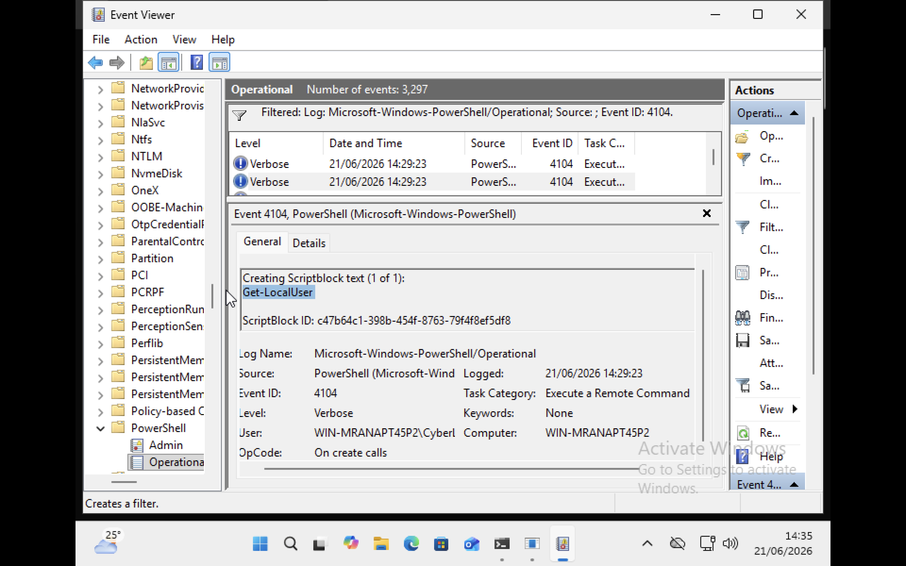
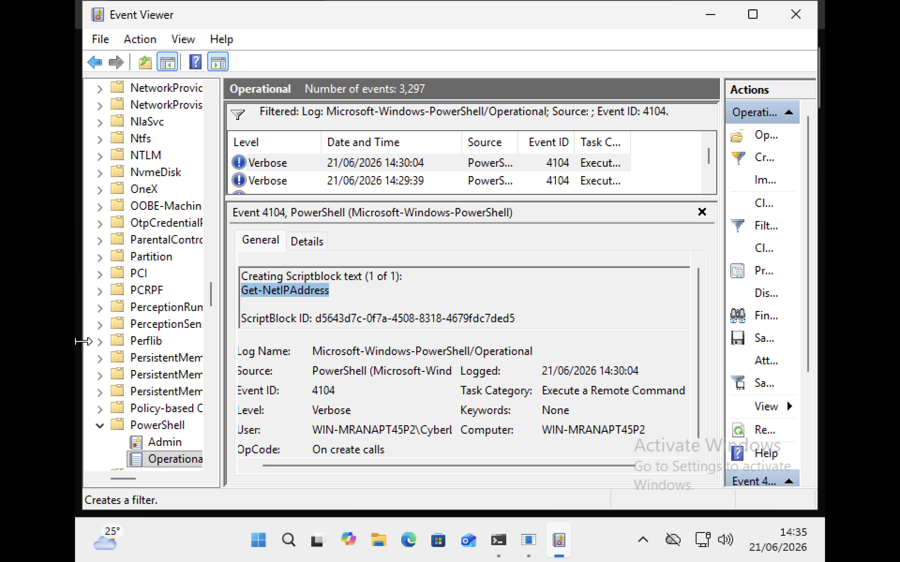
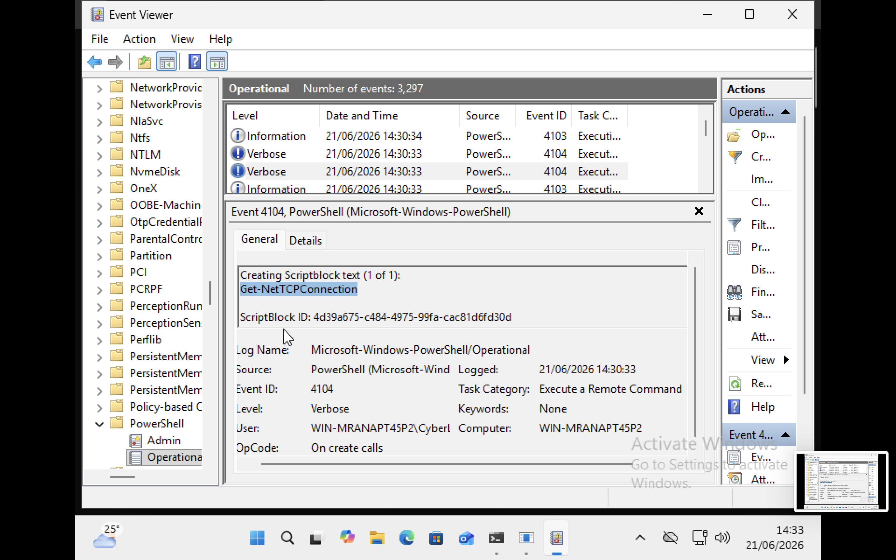
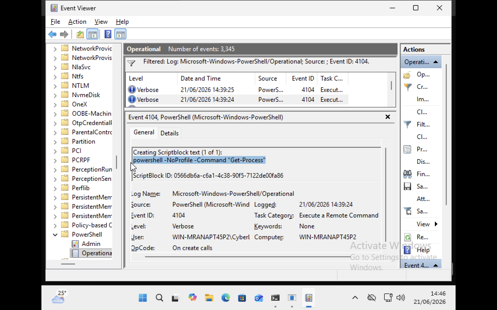
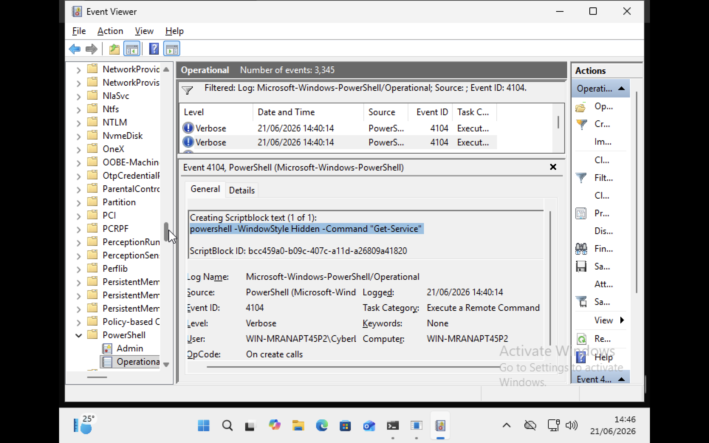

# Suspicious Activity Analysis


This part of research analyse PowerShell behaviours that may indicate suspicious activity within a Windows environment. Rather than executing malware, safe PowerShell commands commonly associated with **attacker reconnaissance** and **defence evasion techniques** were executed in a controlled laboratory environment. PowerShell Operational Logs were then analysed to determine whether behavioural indicators could be identified through Event ID 4104 (Script Block Logging).

## Why Context Matters

One of the key findings of this project is that a PowerShell command should not be judged solely by its name. Context matteres a lot.

For example:

```powershell
Get-Process
```

is commonly used by system administrators.

However:

```powershell
powershell -NoProfile -Command "Get-Process"
```

may deserve additional investigation because PowerShell is being launched with parameters frequently observed during malicious activity. The command itself is not malicious.
The execution context is what changes the security significance.

## Discovery Activity

### Account Discovery

Command executed:

```powershell
Get-LocalUser
```

Screenshot:



The command enumerates local user accounts on the system.

While administrators may use this command for legitimate management tasks, attackers frequently perform account discovery after gaining access to a system.

Behavioural classification:

- Discovery Activity
- Potential Account Enumeration

MITRE ATT&CK:

- T1087 – Account Discovery


### Network Configuration Discovery

Command executed:

```powershell
Get-NetIPAddress
```

Screenshot:



The command retrieves network interface and IP address information.

This behaviour can assist administrators during troubleshooting, but it can also help attackers understand network layout and system positioning.

Behavioural classification:

- Discovery Activity
- Network Enumeration

MITRE ATT&CK:

- T1016 – System Network Configuration Discovery


### Network Connection Discovery

Command executed:

```powershell
Get-NetTCPConnection
```

Screenshot:



Analysis:

The command displays active TCP network connections.

Attackers frequently perform network connection discovery to identify communication channels, remote systems, and active services.

Behavioural classification:

- Discovery Activity
- Network Reconnaissance

MITRE ATT&CK:

- T1049 – System Network Connections Discovery


## Defence Evasion Indicators

### PowerShell NoProfile Execution

Command executed:

```powershell
powershell -NoProfile -Command "Get-Process"
```

Screenshot:




The command launches a new PowerShell instance without loading user profile scripts.

Although legitimate administrative tools may use this option, it is commonly observed in attacker tradecraft because it creates a cleaner execution environment and reduces dependency on user configuration.

Behavioural classification:

- Suspicious PowerShell Execution
- Defence Evasion Indicator

MITRE ATT&CK:

- T1059.001 – PowerShell

### Hidden PowerShell Execution

Command executed:

```powershell
powershell -WindowStyle Hidden -Command "Get-Service"
```

Screenshot:




The command executes PowerShell without displaying a visible console window.

This behaviour is commonly associated with malware, persistence mechanisms, and stealthy execution techniques.

Behavioural classification:

- Suspicious PowerShell Execution
- Stealth Execution Indicator

MITRE ATT&CK:

- T1059.001 – PowerShell


## Comparison of Benign and Suspicious Activity

| Activity | Behaviour Classification |
|-----------|--------------------------|
| Get-Process | Normal Administrative Activity |
| Get-Service | Normal Administrative Activity |
| Get-ComputerInfo | Normal Administrative Activity |
| Get-LocalUser | Discovery Activity |
| Get-NetIPAddress | Discovery Activity |
| Get-NetTCPConnection | Discovery Activity |
| PowerShell -NoProfile | Suspicious Execution Context |
| PowerShell -WindowStyle Hidden | Suspicious Execution Context |
## Key Findings

The analysis demonstrated that PowerShell Operational Logs provide detailed visibility into command execution behaviour. Event ID 4104 successfully captured **both administrative commands and suspicious execution techniques.** The investigation also showed that **command context** is often more important than the command itself. A command such as Get-Process may represent normal administration when executed directly, but may become suspicious when launched using parameters such as NoProfile or WindowStyle Hidden. These findings support the use of **behavioural monitoring rather than signature based detection** alone when investigating PowerShell activity.
